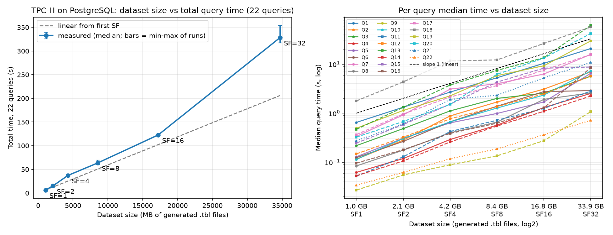
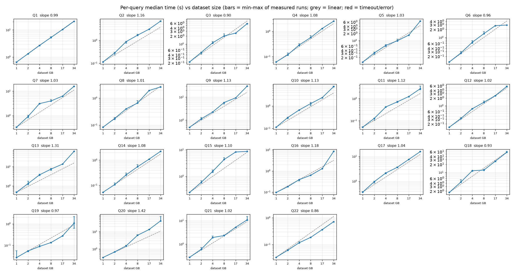

# Problem 1 — Scaling Study Using the TPC-H Benchmark

## Experimental setup

| Item | Value |
|---|---|
| Benchmark | **Official TPC-H Tools v3.0.1** from tpc.org, archive `7C5384AF-10DA-4DCB-B83F-BA2BDE51003F-TPC-H-Tool.zip`, SHA-256 `97ccb34cd122d78c2e06e2419e50957f934256868b37c02d0b88aefd9d13a84a` (included in `official_tpch_materials/`) |
| Tool banners (as printed) | `TPC-H Population Generator (Version 3.0.0 build 0)`, `TPC-H Parameter Substitution (v. 3.0.0 build 0)`: these are the banners of the programs inside the 3.0.1 kit |
| Database | PostgreSQL 16.15, built from source by `setup_postgres_and_dbgen.sh` |
| Machine | Intel Core i9-12900K (16 cores / 24 threads), 62 GB RAM, 931.5 GB NVMe SSD (Crucial CT1000P3SSD8) |
| OS / compiler | Red Hat Enterprise Linux 8.10 (kernel 4.18), gcc 8.5.0 |
| Scale factors | 1, 2, 4, 8, 16, 32 (doubling) |
| Queries | all 22, generated **separately for each SF** with the official `qgen -r 42 -s <SF>` |
| Repetitions | 1 warm-up run (excluded) + 3 measured runs of every query at every SF; medians reported |
| Per-query timeout | 30 min at every SF (never reached) |

PostgreSQL configuration, identical at every scale factor (database cluster
created with `--locale=C --encoding=UTF8`):

```
shared_buffers = 4GB             effective_cache_size = 12GB
work_mem = 128MB                 maintenance_work_mem = 1GB
max_parallel_workers_per_gather = 4    max_worker_processes = 8
random_page_cost = 1.1 (SSD)     max_wal_size = 8GB
jit = off                        synchronous_commit = on
```

Indexes (`indexes.sql`): primary keys on all 8 tables, plus indexes on the
foreign-key columns and on `l_shipdate` / `o_orderdate`. They are built after
loading, identically at every SF.

**The environment was unchanged across scale factors.** SF1–SF16 ran in one
invocation and SF32 in a second, on the same machine, build and
configuration. `results/environment.txt` records both invocations. Apart
from the date, load average and free memory/disk, the two records are
identical: CPU, OS, gcc, PostgreSQL version, every listed setting, tool
banners, timeout and repetition protocol. The load average of the
24-CPU machine was 3.74 when the SF1–SF16 invocation started and 0.08 when
the SF32 invocation started (both recorded in `environment.txt`).

## Procedure (`run_benchmark.sh`, fully automated)

For each scale factor:
1. **Queries.** `generate_queries.sh <SF>` runs the official `qgen -r 42 -s
   <SF>` for queries 1–22 and saves the exact output (`queries/sf<SF>/raw/`),
   the PostgreSQL-adapted query (`queries/sf<SF>/<n>.sql`) and SHA-256 of both.
   The adaptation (`adapt_query.py`) changes only two dialect details. qgen
   (built with `DATABASE=ORACLE`, since the kit has no PostgreSQL option)
   writes row limits as `where rownum <= N;`, which becomes `LIMIT N` (Q2,
   Q3, Q10, Q18, Q21). Q1's `interval '…' day (3)` loses the `(3)`
   precision, which PostgreSQL does not accept. Scale-dependent parameters
   come from qgen, e.g. Q11's threshold is `0.0001000000` at SF1 and
   `0.0000031250` at SF32 (= 0.0001/SF). All 7 query sets (SF1–SF32 and
   the default set) verify against their `SHA256SUMS`. As a cross-check,
   our 110 raw qgen files for SF1–SF16 are byte-identical to the files
   generated independently by a teammate with the same official kit and
   seed.
2. **Data.** The official `dbgen -s <SF>` generates the 8 tables. Each `.tbl`
   file is streamed into `COPY` and deleted after loading. The script
   **aborts** if a load fails or if the loaded row count differs from the
   generated line count (`results/row_counts.csv`, all 48 table/SF pairs
   equal; e.g. `lineitem` 6,001,215 at SF1 and 192,000,551 at SF32).
3. `indexes.sql`, then `VACUUM ANALYZE`. The load time and database size are
   recorded.
4. **Correctness (SF1).** `validate_answers.sh` runs the 22 queries with
   qgen's default parameters (`qgen -d`), which the official answer set
   uses, and compares the results with `dbgen/answers/q<n>.out` using the
   official tolerances (`check_answers/colprecision.txt`). **22/22 pass.**
   The kit's own checker `cmpq.pl` also reports `0 unacceptable
   missmatches` for all 22 (`results/answer_validation/tpc_cmpq_summary.txt`).
   The only non-identical value is Q17 (official 348406.02, ours
   348406.05). It is an `avg` column, which the spec allows to differ by up
   to 1 %; the checker logs it as "OK WITH SPEC".
5. The `EXPLAIN` plan of every query is saved (`results/plans/sf<SF>_q<n>.txt`).
6. **Timing.** All 22 queries run once as a warm-up (run 0), then 3 measured
   runs. For each run we record the wall-clock time around `psql` (including
   connection start-up and result transfer) and the status `ok` / `error` /
   `timeout`.

Reproduce:
```bash
TPCH_KIT=/path/to/7C5384AF-…-TPC-H-Tool.zip ROOT=$HOME/nosql_a1 ./setup_postgres_and_dbgen.sh
source $HOME/nosql_a1/env.sh
./run_benchmark.sh 1 2 4 8 16      # then, in a second invocation:
./run_benchmark.sh 32
python3 plot_results.py
```

## Raw measurements (all in `results/`)

| File | Contents |
|---|---|
| `timings.csv` | 528 rows = 6 SFs × 22 queries × 4 runs (run 0 = warm-up). **All 528 are `ok`** |
| `totals.csv` | per SF and measured run: raw data size, database size, load time, total of the 22 queries |
| `row_counts.csv` | generated vs loaded rows, every table at every SF |
| `scaling_summary.csv` | median per query per SF, ratio for every doubling, log-log slope |
| `answer_validation.csv`, `answer_validation/` | SF1 official answer check: our outputs, per-query result, TPC `cmpq.pl` logs |
| `plans/` | `EXPLAIN` for all 22 queries at all 6 SFs; `EXPLAIN (ANALYZE, BUFFERS)` at SF32 for Q1, Q5, Q6, Q9, Q10, Q13, Q15, Q16, Q18, Q20, Q21 |
| `output/` | query results of the last measured run at each SF |
| `environment.txt`, `tpch_provenance.txt` | environment of both invocations; SHA-256 of the kit, `dbgen`, `qgen`, `dists.dss` and the query templates |
| `benchmark_1_16.log`, `benchmark_32.log` | console logs |
| `scaling_plot.png`, `per_query_plot.png` | plots |

### Totals

| SF | Raw data (MB) | DB size (MB) | Load + index (s) | Run 1 | Run 2 | Run 3 | **Median total (s)** | × previous SF |
|---|---|---|---|---|---|---|---|---|
| 1 | 1,049.7 | 1,704.4 | 18.4 | 6.23 | 6.16 | 6.31 | **6.23** | — |
| 2 | 2,114.6 | 3,397.7 | 38.1 | 16.41 | 15.08 | 13.84 | **15.08** | 2.42 |
| 4 | 4,254.5 | 6,783.8 | 83.2 | 36.48 | 38.15 | 37.05 | **37.05** | 2.46 |
| 8 | 8,555.8 | 13,555.6 | 155.4 | 69.48 | 63.63 | 60.50 | **63.63** | 1.72 |
| 16 | 17,220.6 | 27,102.6 | 308.4 | 121.70 | 123.07 | 122.74 | **122.74** | 1.93 |
| 32 | 34,688.3 | 54,197.3 | 636.1 | 354.27 | 316.77 | 328.23 | **328.23** | 2.67 |

### Per query (median seconds, and the ratio at each doubling)

| Query | SF1 | SF2 | SF4 | SF8 | SF16 | SF32 | ×2/1 | ×4/2 | ×8/4 | ×16/8 | ×32/16 | slope |
|---|---|---|---|---|---|---|---|---|---|---|---|---|
| Q1 | 0.65 | 1.32 | 2.70 | 5.29 | 10.42 | 20.85 | 2.04 | 2.03 | 1.96 | 1.97 | 2.00 | 0.99 |
| Q2 | 0.12 | 0.28 | 0.88 | 1.69 | 3.10 | 6.98 | 2.45 | **3.12** | 1.92 | 1.83 | 2.25 | 1.16 |
| Q3 | 0.22 | 0.49 | 1.11 | 2.00 | 2.56 | 5.73 | 2.23 | 2.29 | 1.80 | **1.28** | 2.24 | 0.90 |
| Q4 | 0.06 | 0.12 | 0.29 | 0.57 | 1.30 | 2.54 | 1.92 | 2.45 | 1.96 | 2.28 | 1.95 | 1.08 |
| Q5 | 0.13 | 0.31 | 0.64 | 0.99 | 1.70 | 6.52 | 2.39 | 2.06 | 1.56 | 1.71 | **3.85** | 1.03 |
| Q6 | 0.12 | 0.27 | 0.67 | 1.39 | 2.76 | 2.90 | 2.15 | 2.51 | 2.08 | 1.99 | **1.05** | 0.96 |
| Q7 | 0.34 | 0.92 | 3.10 | 4.00 | 6.30 | 15.87 | 2.75 | **3.36** | **1.29** | 1.58 | 2.52 | 1.03 |
| Q8 | 0.08 | 0.18 | 0.40 | 0.66 | 1.92 | 2.60 | 2.10 | 2.27 | 1.65 | 2.91 | **1.36** | 1.01 |
| Q9 | 0.49 | 1.14 | 2.26 | 5.84 | 9.28 | 29.86 | 2.31 | 1.98 | 2.59 | 1.59 | **3.22** | 1.13 |
| Q10 | 0.11 | 0.30 | 0.66 | 1.27 | 2.34 | 7.28 | 2.68 | 2.18 | 1.92 | 1.84 | **3.11** | 1.13 |
| Q11 | 0.05 | 0.13 | 0.42 | 0.72 | 1.25 | 2.83 | 2.48 | **3.28** | 1.70 | 1.74 | 2.26 | 1.12 |
| Q12 | 0.15 | 0.32 | 0.77 | 1.36 | 2.48 | 5.67 | 2.18 | 2.38 | 1.77 | 1.82 | 2.28 | 1.02 |
| Q13 | 0.47 | 1.32 | 3.76 | 7.46 | 13.55 | 62.04 | 2.81 | 2.85 | 1.98 | 1.82 | **4.58** | 1.31 |
| Q14 | 0.05 | 0.11 | 0.26 | 0.55 | 1.09 | 2.24 | 2.00 | 2.44 | 2.11 | 2.00 | 2.05 | 1.08 |
| Q15 | 0.25 | 0.59 | 1.53 | 4.31 | 8.30 | 8.75 | 2.39 | 2.61 | 2.81 | 1.93 | **1.05** | 1.10 |
| Q16 | 0.10 | 0.18 | 0.39 | 0.63 | 1.29 | 8.51 | 1.88 | 2.15 | 1.62 | 2.06 | **6.61** | 1.18 |
| Q17 | 0.37 | 0.96 | 2.15 | 3.66 | 7.59 | 15.66 | 2.63 | 2.23 | 1.70 | 2.08 | 2.06 | 1.04 |
| Q18 | 1.78 | 4.36 | 11.64 | 12.22 | 26.46 | 57.21 | 2.45 | 2.67 | **1.05** | 2.16 | 2.16 | 0.93 |
| Q19 | 0.03 | 0.06 | 0.09 | 0.14 | 0.28 | 1.08 | 2.04 | 1.62 | 1.52 | 2.04 | **3.92** | 0.97 |
| Q20 | 0.33 | 0.68 | 1.51 | 6.21 | 13.32 | 42.28 | 2.09 | 2.22 | **4.12** | 2.14 | **3.17** | 1.42 |
| Q21 | 0.28 | 0.60 | 1.91 | 2.32 | 5.26 | 10.82 | 2.19 | **3.18** | **1.22** | 2.26 | 2.06 | 1.02 |
| Q22 | 0.03 | 0.06 | 0.12 | 0.19 | 0.36 | 0.72 | 1.82 | 1.90 | 1.58 | 1.94 | 1.98 | 0.86 |

A ratio of 2 means the time doubled with the data (linear). **Bold** marks
ratios of 3 or more, or 1.4 or less. The slope is fitted to log(time) vs
log(dataset size) over all six SFs: 1 = linear, above 1 = super-linear.

## Performance plots

Dataset size (MB of generated `.tbl` files) against total and per-query time.
The dashed line is linear scaling from SF1; the bars show the min–max of the
3 measured runs.





## Analysis

### Does query time double when the dataset doubles?

**Roughly, but not exactly, and not for every query.** From SF1 to SF32 the
data grew **33.0×** (1,049.7 MB → 34,688.3 MB) and the total median time
grew **52.7×** (6.23 s → 328.23 s), i.e. somewhat faster than linear. The
per-doubling ratio of the total stays between 1.72 and 2.46 up to SF16, then
rises to **2.67 at SF32**, the largest of all steps. Loading and indexing
scale almost exactly linearly (ratios 2.07, 2.19, 1.87, 1.98, 2.06). So the
extra growth comes from query execution, not from the amount of data read. The
total also hides three different behaviours, described below. Each one is
tied to evidence in the saved plans.

### 1. Linear queries: scans, filters and aggregation with stable plans

**Q1, Q4, Q12, Q14 and Q17** have every ratio between 1.70 and 2.63 and slopes
of 0.99–1.08. Their `EXPLAIN` plans have **the same shape at all six scale
factors**, so their cost follows the number of rows processed.
- **Q1** is the cleanest case (ratios 1.96–2.04). It is a filter on
  `l_shipdate` and a hash aggregation into 4 groups. At SF32 the plan is a
  parallel sequential scan of `lineitem` in 5 processes returning 189 M of
  the 192 M rows. The aggregate needs 24 kB per process and the final sort
  27 kB (`sf32_q1_analyze.txt`). The work is essentially "read every row
  once", so time doubles with the data.
- **Q12** (join `orders`–`lineitem`, filter on dates and ship mode, group by
  ship mode) and **Q14** (join with `part`, one aggregate) behave the same
  way: filtering and a small aggregation over a scan.
- **Q17** has a correlated subquery (`0.2 * avg(l_quantity)` per part), but
  its plan is stable, so it stays linear too. A subquery is not super-linear
  by itself; it depends on how the plan executes it.

**Q22** grows a little slower than linear (slope 0.86). It is the fastest
query (0.03 s at SF1), and the measured time includes starting `psql`, which
does not depend on the data. That fixed part is a larger share of the time
for such a short query.

### 2. Steps caused by the planner changing strategy

Several unusual ratios coincide exactly with a change in the saved plans
between two SFs (comparison of `results/plans/sf<A>_q<n>.txt` and `sf<B>_q<n>.txt`):

| Query, step | Ratio | Plan at the smaller SF → plan at the larger SF |
|---|---|---|
| Q6, SF16→32 | 1.05 | bitmap scan through the `l_shipdate` index → **parallel sequential scan** of `lineitem` |
| Q15, SF16→32 | 1.05 | serial aggregation of `lineitem` → **parallel** (Gather + partial HashAggregate) |
| Q18, SF4→8 | 1.05 | serial HashAggregate over a `lineitem` scan → **parallel partial HashAggregate** |
| Q21, SF4→8 | 1.22 | different join order and access paths (index lookups, a `Memoize` node) |
| Q3, SF8→16 | 1.28 | nested-loop joins with index lookups → **parallel hash joins** over sequential scans |
| Q7, SF4→8 | 1.29 | ordinary hash joins → **Parallel Hash Join** with partial aggregation |
| Q8, SF16→32 | 1.36 | more of the joins become parallel hash joins |
| Q20, SF4→8 | 4.12 | hash semi-join → **nested-loop semi-join that runs a correlated subquery per row** |
| Q5, SF16→32 | 3.85 | index nested loop into `lineitem` → parallel sequential scan of `lineitem` + parallel hash joins |
| Q10, SF16→32 | 3.11 | index nested loop into `lineitem` → parallel sequential scan of `lineitem` + hash join |

PostgreSQL chooses plans by estimated cost. As tables grow, index lookups
(cheap when few rows qualify) give way to sequential scans, hash joins and
parallel workers (cheap when many rows qualify). When the switch pays off,
the step is almost flat (Q6, Q15, Q18, Q3). When the new plan does more work
per row, the step is steep (Q20, Q5, Q10). **No query is insensitive to
dataset size overall.** The flat steps are one-off plan switches, and the next
doubling grows again: Q18 goes 1.05 → 2.16, Q7 1.29 → 1.58 → 2.52, Q3 1.28 → 2.24.

### 3. Super-linear queries, and where performance degrades

**Performance degrades most clearly at SF32.** The total ratio is the
highest there (2.67), and seven queries grow by more than 3× in that single
doubling: Q16 6.61×, Q13 4.58×, Q19 3.92×, Q5 3.85×, Q9 3.22×, Q20 3.17×,
Q10 3.11×. At SF32 the database (54.2 GB) is close to the machine's RAM
(62 GB), and PostgreSQL's own buffer cache is 4 GB. The SF32
`EXPLAIN (ANALYZE, BUFFERS)` plans show what each of these queries spends its
time on:

- **Q13 (customer LEFT JOIN orders, count per customer) — join strategy +
  random I/O.** At SF16 the plan is a hash right join over a sequential scan
  of `orders`. At SF32 it is a merge left join that reads `orders` through
  `idx_orders_custkey`, i.e. in customer order instead of disk order. That
  index scan alone takes 59.2 s of the 65.2 s. The query makes 18.4 M page
  reads outside PostgreSQL's buffer cache (`sf32_q13_analyze.txt`).
- **Q16 (part × partsupp, `count(DISTINCT ps_suppkey)`) — lost parallelism
  and a sort spilling to disk.** At SF16 it runs a parallel hash join with a
  parallel merge of sorted results. At SF32 the join is serial, and sorting
  the joined rows exceeds `work_mem` (128 MB). It becomes an **external merge
  sort using 193 MB of temporary disk** (`sf32_q16_analyze.txt`).
- **Q9 (six-table join, profit per nation and year) — many index lookups and
  parallel sorts on disk.** At SF32 the plan looks up `lineitem` through a
  bitmap index scan **1,390,984 times** and `orders` by primary key
  **10,433,108 times**. Each of the 5 parallel sorts spills about 135 MB to
  disk (`sf32_q9_analyze.txt`).
- **Q5 and Q10 (joins driven from `orders`) — switch to scanning `lineitem`.**
  At SF32 both read `lineitem` with a parallel sequential scan and join it
  against a parallel hash table built from the other join input (Q5: 350 MB;
  Q10: 936 MB). At SF16 they looked `lineitem` up through an index instead. Q10's 5 parallel sorts also spill about 138 MB
  each to disk (`sf32_q5_analyze.txt`, `sf32_q10_analyze.txt`).
- **Q20 (nested `IN` with a correlated sum) — per-row subquery execution.**
  Since its plan switch at SF8, the correlated subquery (sum of `l_quantity`
  per part/supplier pair) runs once per candidate `partsupp` row: **786,335
  times** at SF32, each a bitmap index lookup into `lineitem`
  (`sf32_q20_analyze.txt`). Its slope over all SFs is the highest (1.42). Its
  SF32 runs varied from 41.1 s to 75.7 s, consistent with cache-dependent
  random I/O.
- **Q18 (group `lineitem` by order, `HAVING sum(l_quantity) > 300`) — hash
  aggregation spilling to disk.** It is linear from SF8 onwards (2.16, 2.16),
  but at SF32 the aggregation over 192 M rows cannot fit in `work_mem`. The
  final HashAggregate is split into **133 batches using 4.0 GB of temporary
  disk**, and each of the 5 parallel partial aggregations writes a further
  ~1.3 GB (`sf32_q18_analyze.txt`). It is the second-slowest query at SF32
  (57.2 s), after Q13.
- **Q19** has the same plan at SF16 and SF32 but grew 3.92×. Its time is tiny
  (0.28 s → 1.08 s), and its three SF32 runs were 2.21 s, 1.08 s and 0.61 s.
  With so much variation we do not attribute the growth to a cause.

### Relating the observations to database operations

| Operation | Observed effect on scaling | Evidence |
|---|---|---|
| **Filtering / scanning** | linear; parallel sequential scans spread the work over 5 processes | Q1, Q12, Q14; Q6 at SF32 |
| **Aggregation** | linear while the hash table fits in `work_mem`; super-linear once it spills to disk in batches | Q1 (4 groups, 24 kB) vs Q18 (133 batches, 4.0 GB on disk at SF32) |
| **Sorting** | negligible for small final results; external merge sorts on disk once the sort input exceeds `work_mem` | Q16 (193 MB), Q9 and Q10 (~135–138 MB per parallel sort) at SF32 |
| **Joins** | the planner switches between index nested loops, hash joins and merge joins as tables grow. The switch points cause flat steps or sudden jumps | Q3, Q5, Q7, Q10, Q13, Q20, Q21 |
| **Correlated subqueries** | cost = outer rows × inner lookup; super-linear when the plan runs the subquery per row | Q20 (786,335 executions); Q17 stays linear with a stable plan |

## Limitations and notes

- **Not an audited TPC-H result.** We run single-stream query timings only:
  no refresh functions, no throughput test, and we add indexes. This is what
  the assignment asks for, but it is not a TPC-H benchmark result as defined
  by the specification.
- **Two invocations.** SF1–SF16 ran first and SF32 in a second invocation
  later the same day, on the same machine, build and configuration (see
  above). The server is shared with other users: the load average was 3.74
  at the start of the first invocation and 0.08 at the start of the second,
  and we cannot rule out activity by other users during the runs. The spread
  between runs is shown in the totals table and as bars in the plots.
- **Some jumps are not explained by plan changes.** At SF2→SF4, Q2 (3.12×),
  Q11 (3.28×) and Q21 (3.18×) grew fast with an unchanged plan shape, and
  Q19 at SF32 (above). We report these without a verified cause.
- **`EXPLAIN ANALYZE` was captured only at SF32** (after the timed runs), for
  the queries discussed. Plan *shapes* at smaller SFs come from the saved
  `EXPLAIN` output, which shows the chosen operators but not their actual
  row counts or memory use.
- **SF32 is the largest scale factor we ran.** The server's disk is shared;
  about 95 GB was free, and SF32 already needs about 54 GB of database plus up
  to 34 GB of raw data while loading. SF64 would not fit.
- **Warm-up.** The warm-up run is excluded, but the first measured run is
  sometimes still slower (SF2: 16.41 s vs 13.84 s in run 3). Medians of 3
  runs are reported.
